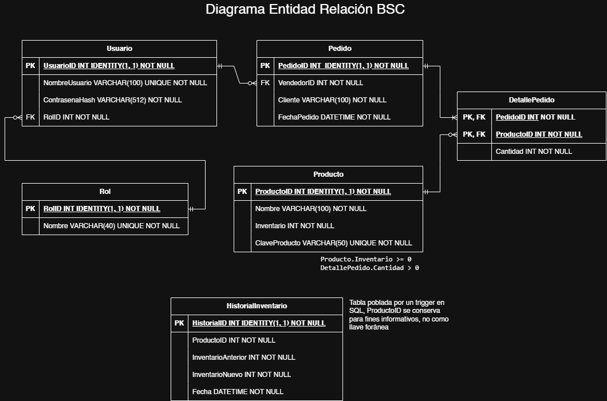
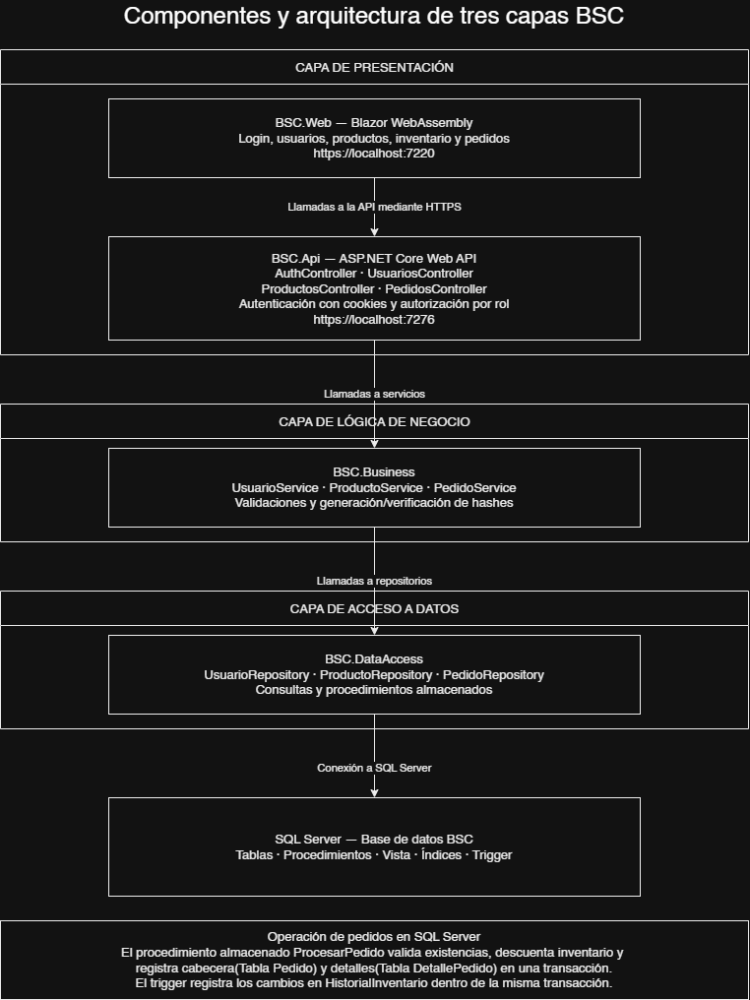

# BSC

Aplicación web para administrar usuarios, productos, inventario y pedidos.

## Tecnologías

.NET 8, Blazor WebAssembly, API REST en C# y SQL Server.

## Proyectos

- BSC.Web: interfaz.
- BSC.Api: endpoints, autenticación y permisos.
- BSC.Business: lógica de negocio.
- BSC.DataAccess: acceso a SQL Server.

## Instalación y ejecución

1. Ejecutar `database/BSC_INITIALIZE.sql` en SQL Server para crear la base BSC y sus datos iniciales.
2. Ajustar la conexión en `BSC.Api/appsettings.json`.
3. Abrir la solución en Visual Studio y restaurar los paquetes NuGet.
4. Iniciar BSC.Api y BSC.Web mediante HTTPS (se inician simultáneamente al iniciar la solución).
5. Abrir https://localhost:7220.

API: https://localhost:7276.

## Acceso inicial

- Usuario: admin
- Contraseña: administrador1

## Perfiles

- Administrador: crear usuarios y asignar perfiles.
- Personal administrativo: registrar productos, agregar inventario y consultar existencias y pedidos.
- Vendedor: consultar existencias y crear pedidos mediante un carrito.

## Base de datos

Incluye tablas relacionadas, procedimientos almacenados, una vista de pedidos, índices y un trigger de historial de inventario.

Los pedidos se guardan en una transacción. Si falta inventario, se revierte toda la operación.

## Consideraciones

- Las contraseñas se almacenan como hashes.
- El carrito es temporal y no reserva existencias.
- Los permisos se validan en la API.

## Diagramas

- Entidad-relación: Diagrama_Entidad-Relacion.png
- Componentes: Diagrama_Componentes.png

